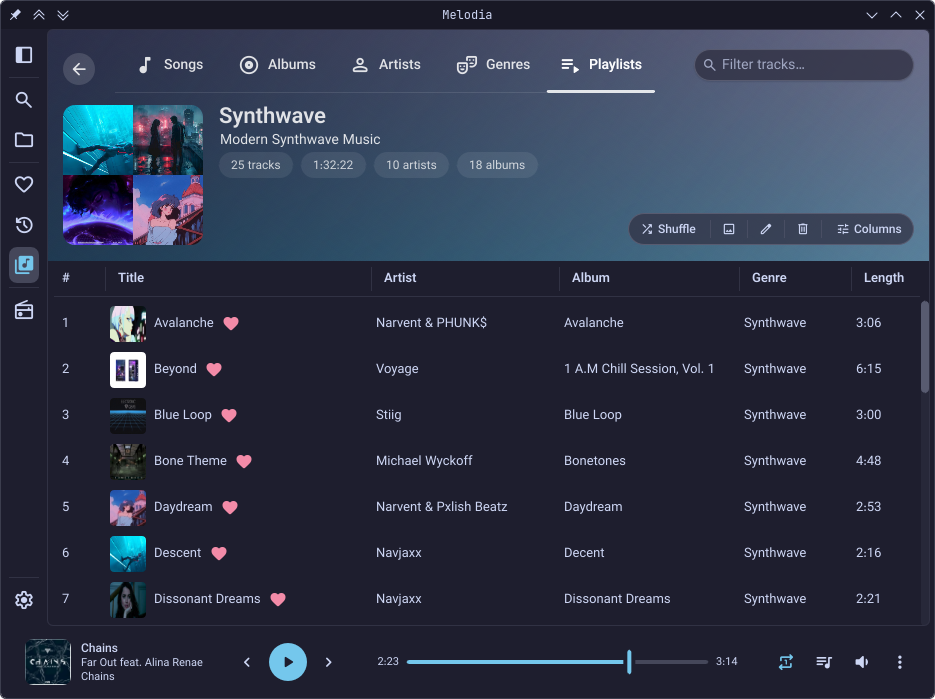
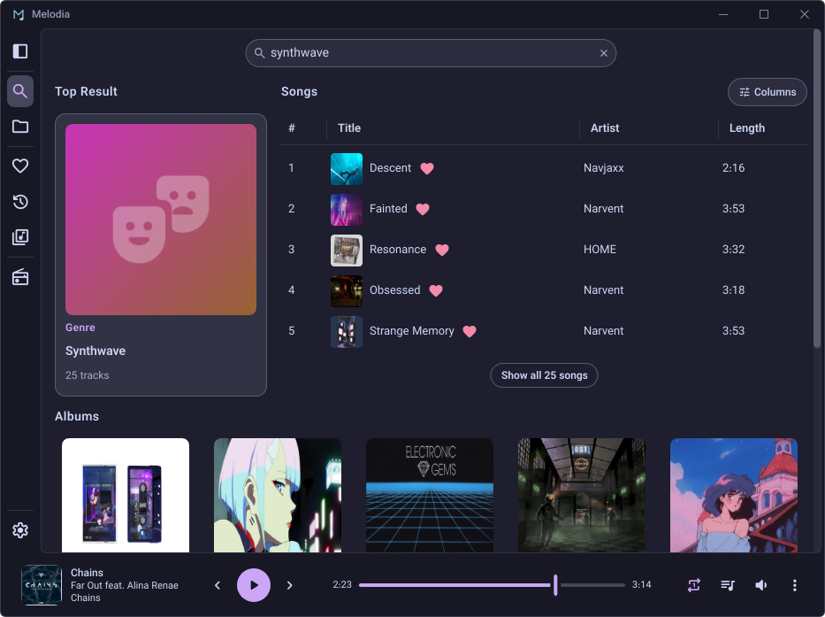
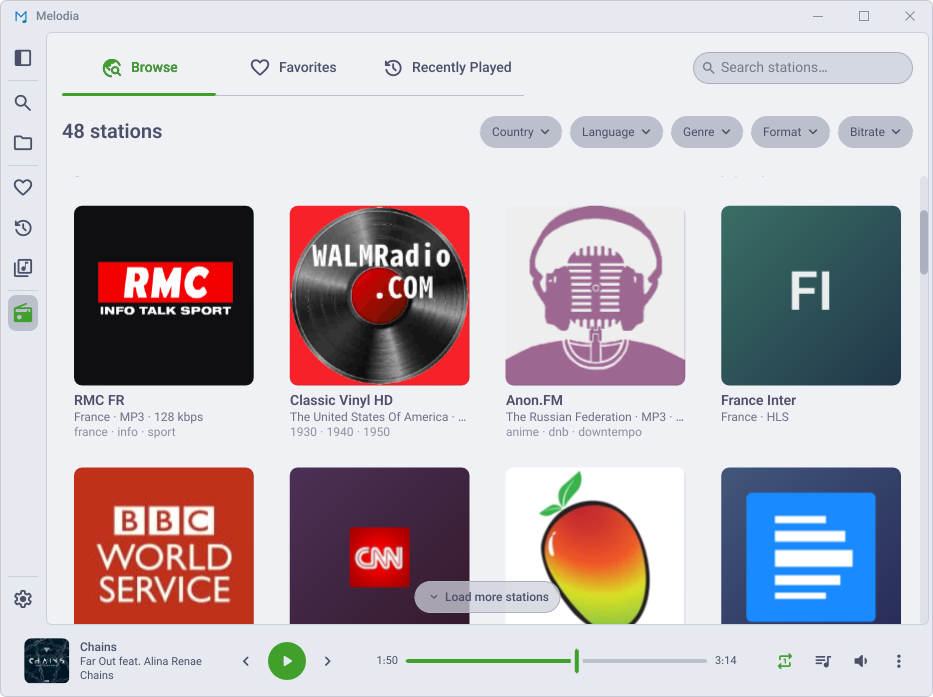
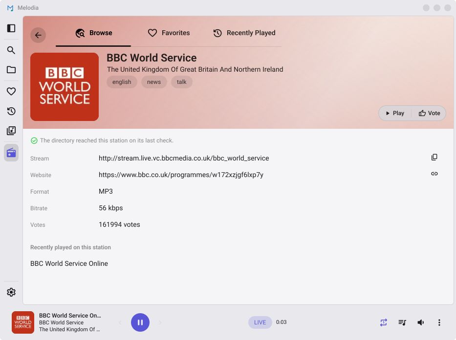

# Melodia

**A fast, lightweight cross-platform desktop music player built with [Slint](https://slint.dev/) and pure Rust.**

[](LICENSE)
[](https://github.com/KenanSalar/Melodia/releases)
[](#installation)
[](https://www.rust-lang.org/)

Melodia is a Slint rewrite of a former Tauri + SolidJS application. Dropping the embedded WebKitGTK browser engine took the real-world footprint from a combined **~900MB** to 88MB idle on Linux and 58MB on Windows (PSS); the [full numbers](#footprint) are below.

---

## Screenshots

Six theme families, light and dark variants, configurable accents, and Material You dynamic color; the shots below are a handful of them, all on the default aurora backdrop. See [Themes](#themes) below for the full list.

### Library

<table>
  <tr>
    <td width="50%"><br><sub><b>My Library</b>: one page and five tabs, here over a virtualized cover grid.</sub></td>
    <td width="50%"><br><sub><b>Detail in place</b>: opening a playlist grows the band into its banner, tabs still in reach.</sub></td>
  </tr>
  <tr>
    <td><br><sub><b>Search</b>: a top-result card over songs, albums, artists, and genres.</sub></td>
    <td><br><sub><b>Browse</b>: navigate the library by folder, as a list or a grid of cards.</sub></td>
  </tr>
</table>

### Favorites

<table>
  <tr>
    <td><br><sub><b>Favorites</b>: an artwork mosaic hero over tabs for songs, most played, and favorite artists. Recently Played is built the same way.</sub></td>
  </tr>
</table>

### Internet Radio

Off until you switch it on, under Settings ▸ Services ▸ Radio.

<table>
  <tr>
    <td width="50%"><br><sub><b>Browse</b>: a worldwide directory, narrowed by country, language, genre, codec, or bitrate.</sub></td>
    <td width="50%"><br><sub><b>Station page</b>: logo, homepage, format, bitrate, votes, and what the station has announced this session.</sub></td>
  </tr>
</table>

### Mini-player

Shrink the window past a threshold and the full UI collapses into a compact mini-player.

<table>
  <tr>
    <td width="60%" valign="top"><br><sub><b>Horizontal strip</b>: the most compact form.</sub></td>
    <td width="40%" valign="top"><br><sub><b>Square widget</b>: grows an up-next list when tall enough.</sub></td>
  </tr>
</table>

---

## Features

### Library
- Parallel folder scanning, live folder watching, and incremental re-scans
- Content hashing (BLAKE3), so a moved or renamed file keeps its play counts, favorites, and place in the queue
- Full-text search (SQLite FTS5) over tracks, albums, artists, and genres: accent-insensitive, relevance-ranked, with a top-result card and recent history. The filter box on every list searches the same fields
- **My Library** gathers everything into one page with five tabs (Songs, Albums, Artists, Genres, Playlists); opening an entity grows the tab band into its banner rather than navigating away
- Favorites and Recently Played, each a hero banner over sortable lists and browsable card grids
- Browse by folder, as a detailed list or a grid of cards
- Star ratings, play and skip counts, natural sort, resizable and toggleable columns
- Tag editing for one track or many at once, cover art included, written straight back to the files
- Manual and smart playlists, the latter rule-based and resolved live; `.m3u8` import and export, drag-and-drop import and reordering
- A database backup before every schema migration, three kept

### Playback
- Gapless, including the AAC encoder delay and padding read back from `iTunSMPB` or the MP4 edit list
- Crossfade (1–12 s) across two decks with a clip-safe ramp, optionally skipped between same-album tracks
- 10-band equalizer (31 Hz – 16 kHz) with preamp, presets, and a soft-knee limiter
- ReplayGain in track or album mode, with preamp and peak-based clip prevention
- Queue with shuffle and repeat; playing from any list queues that list behind your pick
- Full-screen Now Playing with an up-next list and a spectrum, mirrored, or waveform visualizer tinted to the album's own colors
- Playback speed 0.25×–2.0×, a playback-linked sleep timer, resume on startup, media keys
- Responsive mini-player: shrink the window and the UI collapses to a strip or a square widget

### Internet Radio
- **Off until you switch it on**, under Settings ▸ Services ▸ Radio. Nothing contacts the directory until you do
- A worldwide directory (**radio-browser.info**, no account and no API key) narrowed by country, language, genre, codec, or bitrate
- Your own stream URLs, checked at the dialog rather than at the first click; `.pls`, `.m3u`, and `.asx` resolve to the audio behind them
- Live titles reach the player bar, Now Playing, your desktop's media controls, and Discord, with buffering and reconnection handled underneath
- Favorites, Recently Played, station pages, cached logos, and playlist-file import and export
- Segmented (HLS) stations play like any other

### Themes
Six families, each with light and dark variants and configurable accents: **Catppuccin** (Latte, Frappé, Macchiato, Mocha), **Material 3**, **GNOME Adwaita**, **KDE Breeze**, **Windows Fluent**, and **macOS**. System dark/light is followed automatically, KDE color schemes are read from `kdeglobals`, and Material You derives a palette from the current artwork in seven color styles. Headers paint an aurora of the album's own colors by default, or a blurred cover instead. The titlebar is custom and transparent, with native decorations available.

### Formats and languages
MP3, FLAC, M4A/M4B (AAC and ALAC), raw AAC (`.aac`), Ogg Vorbis (`.ogg`, `.oga`), WAV (PCM and ADPCM), AIFF/AIFF-C, Matroska (`.mka`), and CAF. Matroska and CAF carry no tags Melodia can read, so those tracks list under their filename, as does anything whose tags are too damaged to parse.

Seven locales (English, German, French, Spanish, Turkish, Greek, Italian), switchable at runtime with no restart.

### System integration
- Scrobbling to **Last.fm** and **ListenBrainz**, each independently, with loved-track sync that catches your existing favorites up on connect, and a durable offline queue
- Optional MusicBrainz auto-tagging, so loved tracks resolve even for a library with no MusicBrainz IDs
- **Discord Rich Presence** (off by default): title, artist, album, and optionally a cover looked up on Deezer, sent to your running Discord client. Nothing leaves the machine while it is off
- OS media controls (MPRIS2 on Linux, SMTC on Windows) and media keys
- Set Melodia as your default player and double-click a track; it runs as a single instance, so files open in the window you already have
- Always-on-top on KDE and GNOME, a self-deploying desktop entry, and AppStream metadata for KDE Discover and GNOME Software
- Window, queue, and navigation state persisted across sessions

## Footprint

| Scenario | RSS | PSS | Heap | Mapped | CPU |
| --- | --- | --- | --- | --- | --- |
| Idle (Fedora) | 158 MB | 88 MB | 33 MB | 125 MB | 0.1% |
| Playing, list view (Fedora) | 158 MB | 89 MB | 34 MB | 124 MB | 0.6% |
| Playing, visualizer live (Fedora) | 166 MB | 96 MB | 34 MB | 132 MB | 4.0% |
| Idle (Windows) | 117 MB | 58 MB | 54 MB | 63 MB | 0.1–0.2% |
| Playing, list view (Windows) | 125 MB | 65 MB | 61 MB | 64 MB | 0.8–1.0% |
| Playing, visualizer live (Windows) | 132 MB | 71 MB | 67 MB | 65 MB | 9.6–9.9% |

Release builds against the same 512-track library, each on a 16-core machine with the window on the same 144 Hz display, measured after the process had settled. CPU is a share of **one** core.

**Heap** is what the application itself allocates, and it is the number that stays flat: grids and track lists are virtualized and the cover caches are capped against the display, so a larger library barely moves it. **Mapped** is the file-backed remainder, mostly the binary and the shared graphics stack rather than anything Melodia allocated, which is why **PSS** is the fairer whole-process figure on a desktop already running other GL applications.

## Keyboard Shortcuts

| Action | Shortcut |
|--------|----------|
| Play / Pause | `Space` |
| Seek backward / forward 5s | `←` / `→` |
| Seek backward / forward 30s | `Shift+←` / `Shift+→` |
| Previous / Next track | `Ctrl+←` / `Ctrl+→`, or `P` / `N` |
| Volume up / down 5% | `↑` / `↓` |
| Volume up / down 1% | `Ctrl+↑` / `Ctrl+↓` |
| Seek to 0–90% | `0`–`9` |
| Mute | `M` |
| Favorite current track | `L` |
| Shuffle | `S` |
| Repeat mode | `R` |
| Queue sheet | `Q` |
| Now Playing view | `F` |
| Maximize | `F11` |
| Toggle sidebar | `Ctrl+B` |
| Settings | `Ctrl+,` |
| New playlist | `Ctrl+N` |
| Close dialog / Now Playing | `Esc` |
| Navigate back / forward through history | `Mouse-4` / `Mouse-5` |

OS media keys (play/pause, next, previous, stop) are also handled.

## Installation

Linux (X11 and Wayland) and Windows, on both `x86_64` and `aarch64`. Take the latest build from the
[Releases page](https://github.com/KenanSalar/Melodia/releases).

| Format | Install |
|--------|---------|
| `.rpm` (Fedora/RHEL) | `sudo dnf install ./melodia-*.rpm` |
| `.deb` (Debian/Ubuntu) | `sudo apt install ./melodia-*.deb` |
| AppImage | `chmod +x melodia-*.AppImage && ./melodia-*.AppImage` |
| Tarball | Extract, then `./install-linux.sh`, which installs into `~/.local/share/Melodia` with no `sudo`, so the in-app updater needs no polkit prompt |
| Windows | Run the installer, or use the portable binary |

Melodia updates itself in place, minisign-signed. Release artifacts also carry
build-provenance attestations, verifiable with:

```bash
gh attestation verify <file> --repo KenanSalar/Melodia
```

## Building from Source

[Rust](https://rustup.rs/) **1.97.0**, edition 2024, pinned by `rust-toolchain.toml` and installed by
rustup on its own. Linux additionally needs the development packages for Slint's FemtoVG renderer
(no WebKitGTK); macOS and Windows need nothing extra.

```bash
# Debian/Ubuntu
sudo apt install libfontconfig1-dev libfreetype6-dev libasound2-dev \
                 libxkbcommon-dev mesa-vulkan-drivers libwayland-dev

# Fedora
sudo dnf install fontconfig-devel freetype-devel alsa-lib-devel \
                 libxkbcommon-devel vulkan-loader wayland-devel
```

```bash
git clone https://github.com/KenanSalar/Melodia.git
cd Melodia

cargo run -p melodia                                     # debug build, runs the app
cargo build --release -p melodia                         # release → target/release/Melodia
cargo clippy --all-targets --workspace -- -D warnings    # lint
cargo test --workspace                                   # tests
```

A source build keeps its own library under `Melodia-dev`, beside an installed copy's folder rather
than inside it, so a schema migration still on a branch can't leave an installed Melodia unable to
open its database, and the two can run at once. `MELODIA_DATA_DIR` points either build at a
directory of your choosing.

`winit/` is a checked-in copy of winit 0.30.13 plus an unmerged Wayland file drag-and-drop fix
([winit#1881]), wired by `Cargo.toml`'s `[patch.crates-io]`. A fresh clone builds with no setup;
dropping the patch costs only that drag-and-drop.

Last.fm scrobbling needs an [API application](https://www.last.fm/api/account/create)'s key and
shared secret, which identify the app rather than any account. They are read at compile time from
`LASTFM_API_KEY` / `LASTFM_SHARED_SECRET`, so nothing secret lives in the repo; for local builds,
copy `.env.example` to `.env` and `build.rs` bakes them in. A build without them is fully
functional, ListenBrainz included, and the Last.fm Connect button reports "not configured in this
build". A fork wanting its own Discord presence sets `MELODIA_DISCORD_APP_ID`.

[winit#1881]: https://github.com/rust-windowing/winit/issues/1881

## Architecture

The Slint UI runs on the main thread and a single multi-threaded Tokio runtime handles the database,
scanner, watcher, player control, and HTTP. There is no WebView and no IPC boundary: UI callbacks
spawn async work, state flows back over `watch` and `mpsc` channels consumed by UI-thread tasks, and
cpal's device callback pulls the mixer directly, so decoding, the DSP chain, and the mix stay off the
runtime entirely.

Fourteen crates, layered so the compiler enforces the direction rather than a convention: the UI
names no database or socket, the decoders name no mixer, the tag writer names no state machine.
Slint 1.16 on FemtoVG, Tokio, Symphonia and cpal, SQLite via SQLx with WAL and FTS5, Lofty for tags,
Rayon, BLAKE3, and minisign for the updater.

[`CLAUDE.md`](CLAUDE.md) is the architecture reference; [`docs/adr/`](docs/adr/) records why each
piece was chosen over the alternatives.

## Data and Logs

Everything lives under the OS application-data directory, `~/.local/share/Melodia` on Linux and
`%APPDATA%\Melodia` on Windows:

| File / folder | Purpose |
|---------------|---------|
| `melodia.db` | The music library (SQLite, WAL + FTS5) |
| `settings.json`, `views.json`, `queue.json` | Preferences, per-view UI state, and the queue with the station tuned over it |
| `scrobble_*.json` | Last.fm session key and ListenBrainz token (`0600` on Unix), plus the offline queue |
| `artwork/`, `artists/`, `radio-logos/` | Cached album, artist, and station images |
| `backups/` | Database copies taken before each schema migration |
| `logs/` | Rolling logs and crash reports |

`MELODIA_DATA_DIR` moves the whole folder somewhere else.

Melodia writes a log on every run, with no environment variable and no terminal needed, and leaves a
crash report beside it if it ever panics. The current log is `melodia_rCURRENT.log`; it rotates at
2 MiB and keeps the 7 most recent, so `logs/` stays under about 16 MiB.

**Settings → About → Diagnostics** opens that folder, saves a single `melodia-diagnostics-*.txt` to
attach to a bug report, and toggles verbose logging. The report carries your version, OS, desktop
session and install method, your library's size, a short fixed list of settings, recent crash
reports, and the tail of the logs. Home directory paths are shortened to `~`, and **no credentials,
tokens or session keys are ever included**; those live in a separate file the report doesn't read.

If Melodia won't start at all, `melodia --logs` prints the log directory and exits. That covers Linux
and macOS: a Windows build runs with no console attached, so use `%APPDATA%\Melodia\logs\` directly.
For finer control than the verbose switch, `RUST_LOG=debug melodia` overrides the filter for both the
log file and the terminal.

## Contributing and Support

Contributions are welcome. [`CONTRIBUTING.md`](CONTRIBUTING.md) has the setup, the checks to run
before pushing, and how pull requests are handled.

Melodia is free, open source, and built in my spare time, with nothing gated behind payment. If it's
useful to you, you can support me at [ko-fi.com/kenansalar](https://ko-fi.com/kenansalar), the same
link the app carries at **Settings → About**.

## License

Copyright (C) 2026 Kenan Salar. Melodia is free software under the
[GNU Affero General Public License](LICENSE), version 3 or, at your option, any later version, and is
distributed without any warranty.

The AGPL covers Melodia itself. Two fonts and a patched winit fork are compiled into the binary under
their own terms; every one of those licenses ships in [`licenses/`](licenses/), which every package
carries alongside this file.

## Acknowledgments

Built on the work of the [Slint](https://slint.dev/),
[cpal](https://github.com/RustAudio/cpal),
[Symphonia](https://github.com/pdeljanov/Symphonia), and
[SQLx](https://github.com/launchbadge/sqlx) projects, the
[Catppuccin](https://catppuccin.com/) palette, and
[Material Foundation](https://m3.material.io/)'s color utilities, along with the many other crates
listed in `Cargo.toml`. The station directory is [radio-browser.info](https://www.radio-browser.info)
(CC0 data, no account).

Melodia's interface is set in [Vazirmatn](https://github.com/rastikerdar/vazirmatn) (SIL Open Font
License 1.1) and draws its icons from
[Material Symbols Rounded](https://github.com/google/material-design-icons) (Apache License 2.0).
Both are modified, as is the vendored [winit](https://github.com/rust-windowing/winit) fork
(Apache License 2.0) that gives Wayland its drag-and-drop events. What changed in each ships in
[`licenses/`](licenses/).
