# Melodia

**A fast, lightweight cross-platform desktop music player built with [Slint](https://slint.dev/) and pure Rust.**

Melodia is a Slint rewrite of a former Tauri + SolidJS application — moving off the embedded WebKitGTK browser engine cut the real-world footprint from a combined **~900 MB** down to **below 150 MiB on Fedora** and **below 110 MB on Windows**, with no IPC layer and no web runtime.

[](LICENSE)
[](https://github.com/KenanSalar/Melodia/releases)
[](#platforms)
[](https://www.rust-lang.org/)

---

## Screenshots

### Library

<table>
  <tr>
    <td width="50%">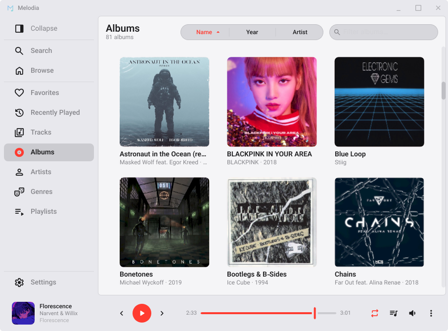<br><sub><b>Albums</b> — a virtualized cover grid (light theme here).</sub></td>
    <td width="50%">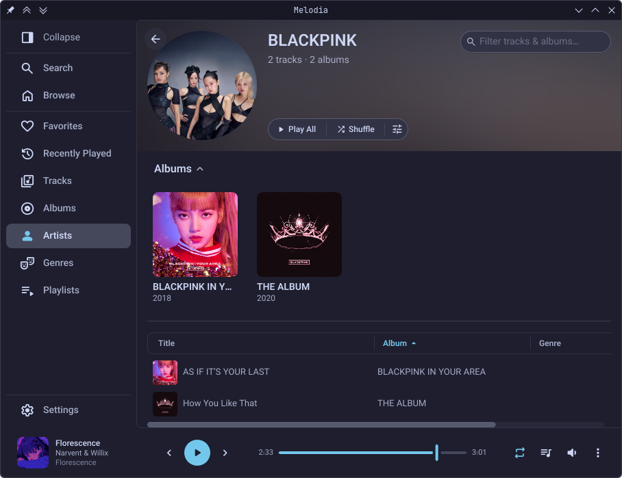<br><sub><b>Artist detail</b> — a hero-blur backdrop, an albums strip, and the track list.</sub></td>
  </tr>
  <tr>
    <td>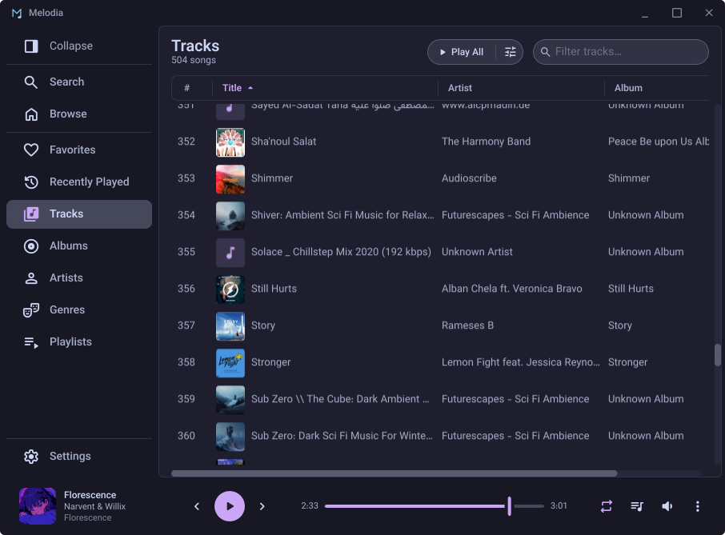<br><sub><b>Tracks</b> — every song, with sortable, resizable, toggleable columns.</sub></td>
    <td>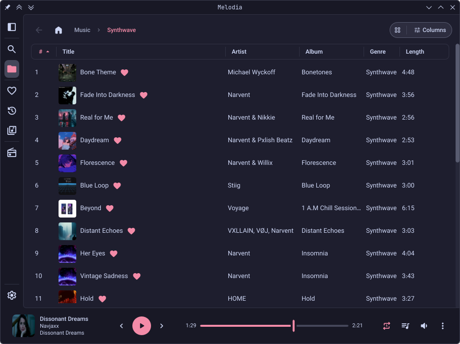<br><sub><b>Browse</b> — navigate the library by folder.</sub></td>
  </tr>
</table>

### Playlists & Collections

<table>
  <tr>
    <td width="50%">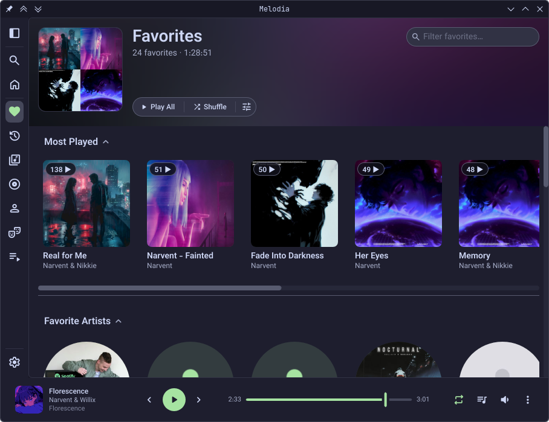<br><sub><b>Favorites</b> — an artwork mosaic hero over tabs for songs, most played, and favorite artists.</sub></td>
    <td width="50%">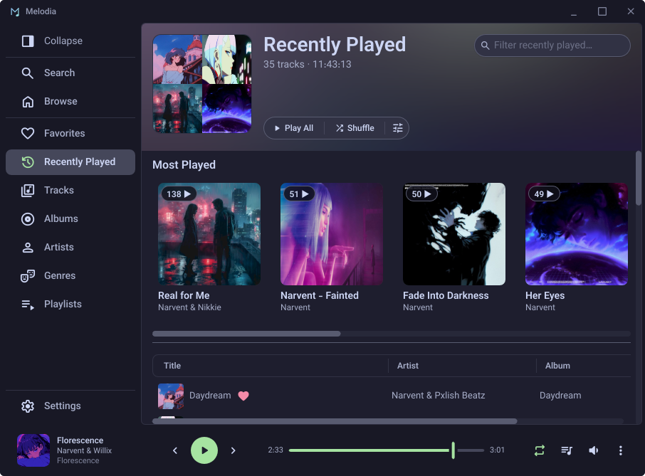<br><sub><b>Recently Played</b> — newest first, updating live as you listen.</sub></td>
  </tr>
  <tr>
    <td>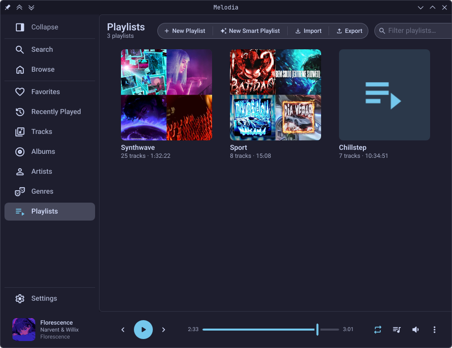<br><sub><b>Playlists</b> — manual and smart playlists, with M3U8 import and export.</sub></td>
    <td>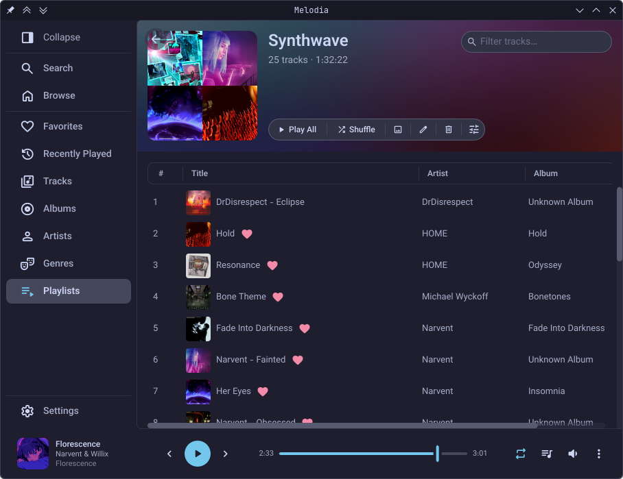<br><sub><b>Playlist detail</b> — inline favorites and hover-revealed star ratings.</sub></td>
  </tr>
</table>

### Theming

Six theme families, light and dark variants, configurable accents, and Material You dynamic color — see [Themes](#themes) below for the full list.

<table>
  <tr>
    <td width="50%">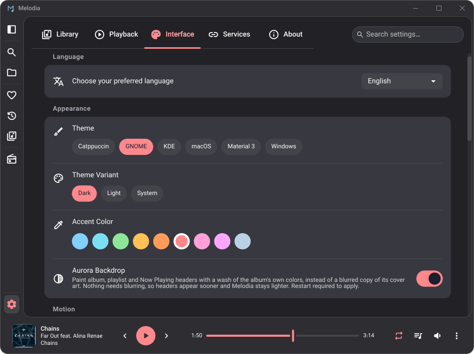<br><sub><b>Catppuccin Mocha</b> — theme, variant, and accent picker.</sub></td>
    <td width="50%">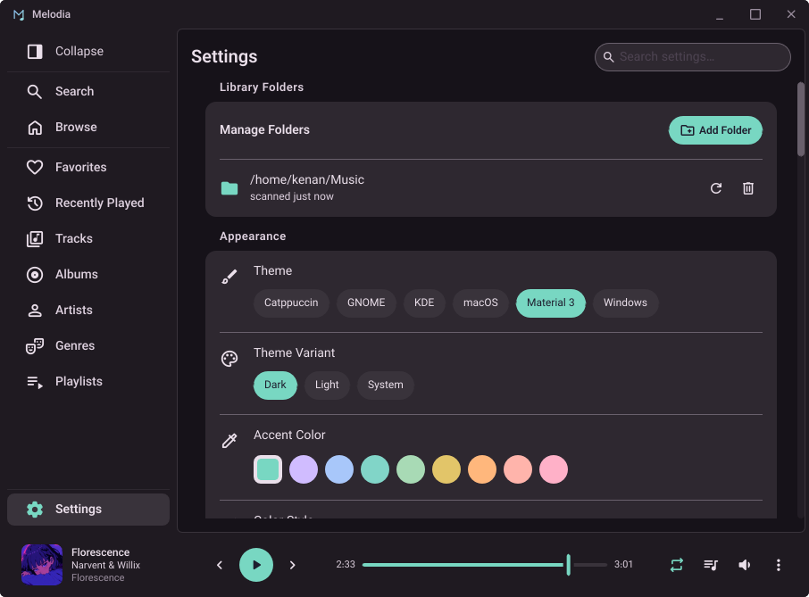<br><sub><b>Material 3</b> — the same screen with a different palette.</sub></td>
  </tr>
</table>

### Mini-player

Shrink the window past a threshold and the full UI collapses into a compact mini-player.

<table>
  <tr>
    <td width="60%" valign="top"><br><sub><b>Horizontal strip</b> — the most compact form.</sub></td>
    <td width="40%" valign="top">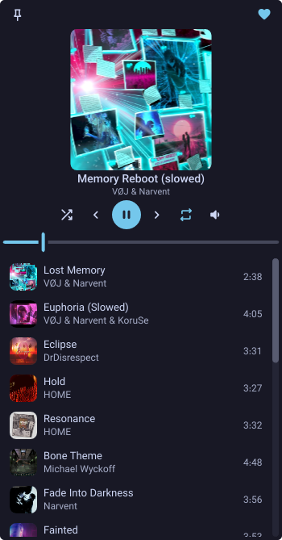<br><sub><b>Square widget</b> — grows an up-next list when tall enough.</sub></td>
  </tr>
</table>

---

## Features

### Library Management
- Automatic scanning of music folders with parallel metadata extraction (Rayon)
- First-launch auto-detection of the OS Music directory
- Real-time folder watching with debounced re-scanning and incremental updates
- Content-hash-based moved-file detection (BLAKE3) that preserves play counts, favorites, and queue state when files are renamed or relocated
- Search across tracks, albums, artists, and genres, with a top-result card, entity rows, and persistent recent search history. Tracks are full-text indexed (SQLite FTS5) on title, artist, album artist, album, genre, composer, year, and file name, so a genre or a year finds everything tagged with it and a partial year ("199") finds the decade. The album and artist rows match by name *and* through their own tracks, so searching a song title, a year or a genre surfaces the albums and artists behind it — and a genre can itself be the top result. That index ignores accents on both sides, so "bjork" finds Björk and "be" finds Bế Tắc — and because the album and artist rows match through it too, an unaccented query still surfaces them. Results are ranked by relevance: a match in the title outranks one in the artist, and a filename that merely echoes the tags beside it ranks below the tags it repeats
- Browse by albums, artists, genres, or the file system
- Dedicated detail pages for albums, artists, genres, and playlists
- Deezer-backed artist image fetching with local caching
- Favorites view built around a hero banner — artwork mosaic, live counts, and a tab bar sharing that row with the filter — over three sub-views: every favorite as a sortable track list, your most-played favorites as a browsable card grid, and your favorite artists as another. Favorite artists sort by name or by how many of their tracks you've favorited, either direction; the filter narrows whichever tab you're on, and the page reopens on the tab — and the sort — you left it on
- Recently-Played view listing the tracks you last listened to (newest first), with a most-played strip and a filterable track list that updates live as you play
- Play-count and skip-count tracking per track
- Per-track star ratings (0–5), set inline via a hover-revealed star control in any track list and from the Now Playing view
- Edit track information (title, artist, album, album artist, genre, year, track/disc number, composer, comment, BPM, lyrics, and cover art) for one or many selected tracks at once, written straight back to the files — batch edits leave differing fields untouched and save only the fields you change
- Natural sort ordering for file and track names
- Customizable, resizable, and toggleable track-list columns
- Playlist creation and management with custom thumbnails
- Smart (dynamic) playlists whose membership is defined by rules rather than a fixed track list — match **all** or **any** of a set of conditions across fields like genre, artist, rating, year, play count, favorite, or when a track was last played/added, with an optional size cap and ordering (e.g. "50 most-played" or "top-rated"); membership is resolved live, so a smart playlist keeps itself up to date as your library and listening change
- Import and export playlists as standard `.m3u8` files (with embedded BLAKE3 content hashes) so they survive a database reset and interoperate with other players
- Drag-and-drop file import to playlists and the queue
- Drag-and-drop track reordering in playlists and the play queue
- Automatic pre-migration database backups

### Playback
- Gapless playback with a 2-deep Rodio queue
- Audio crossfade (1–12 s) that overlaps the end of one track with the start of the next, running the two on separate mixer decks with a sample-accurate complementary ramp so the sum can never clip; optionally skips same-album transitions to keep continuous mixes gapless, extends to manual track changes, and fades out on pause and stop
- Queue management with shuffle and repeat modes (Off, All, One)
- Playing a track from any list — an album, a playlist, a folder in Files, search results, Favorites — loads that whole list into the queue and starts on the track you picked, so the rest of the album or playlist follows on its own. With shuffle already on, the remaining tracks are shuffled behind your pick rather than played in order. **Play Next** and **Add to Queue** in the right-click menu still add to the existing queue without replacing it
- A **Shuffle** pill on Favorites, Recently Played and the album, artist, genre and playlist pages loads whatever that view is currently showing — filter it first and only the matches are queued — and opens on a random track rather than the top of the list
- Full-screen Now Playing view with track details, an up-next list, and album-art cross-fade transitions
- Audio visualizer under the Now Playing artwork, tapped off the post-DSP audio and tinted to the album's own accent colour, in three styles switchable from the view itself or from Settings — a 64-band spectrum analyzer, the same bands mirrored about a centre line, or a live waveform trace; bands are logarithmic across 50 Hz – 16 kHz (the equalizer's own range) so every bar covers the same musical interval, and the whole thing decays to rest on pause or can be switched off entirely
- 10-band graphic equalizer (31 Hz – 16 kHz) with adjustable preamp, nine built-in presets plus hand-tuned custom curves, and a soft-knee clip-protection limiter so boosts compress instead of clipping
- ReplayGain loudness normalization — applies per-track or per-album gain from the file's loudness tags (Track or Album mode), with an adjustable preamp and optional peak-based clip prevention; reuses the equalizer's soft-knee limiter so a boosted track compresses instead of clipping, and works with the equalizer off
- Playback speed control (0.25× – 2.0×)
- Sleep timer that pauses playback after a preset (15–90 min) or custom duration, or at the end of the current track; the duration countdown is playback-linked, so pausing the music holds the timer
- Volume control (0–100%) with mute
- Resume playback on startup
- OS media-key support
- Configurable play-button animation (none, ripple, or animated equalizer bars)
- Customizable player bar — relocate secondary controls into a compact overflow menu
- Responsive mini-player — shrinking the window past a threshold collapses the full UI into a compact horizontal strip or a square widget (the square grows an up-next list when tall enough); restore the full window from the mini-player's expand button

### Themes
Six theme families, each with light and dark variants and configurable accent colors:
- **Catppuccin** (Latte, Frappé, Macchiato, Mocha)
- **Material 3**
- **GNOME Adwaita**
- **KDE Breeze**
- **Windows Fluent**
- **macOS**

Automatic system dark/light mode detection is supported. Material You dynamic theming derives a palette from the current track's artwork, with selectable color styles (Tonal Spot, Vibrant, Expressive, Fidelity, Content, Monochrome, Neutral). On KDE, color schemes are read from `kdeglobals` for native palette integration, and the sidebar and now-playing bar can be tinted toward the content background when the window loses focus. A custom transparent titlebar is used by default — with an adjustable window corner radius — alongside an option to fall back to native window decorations.

### Supported Audio Formats
MP3, FLAC, M4A/AAC, OGG/Vorbis, WAV, ALAC, AIFF

### Internationalization
- 7 locales: English, German, French, Spanish, Turkish, Greek, Italian
- Slint-native `@tr()` translations with bundled `.po` files compiled into the binary
- Runtime locale switching with no restart

### System Integration
- Scrobbling to **Last.fm** and **ListenBrainz** — connect either or both, report each qualifying play plus a live "now playing" status, and mirror your favorites to their loved/feedback tracks with a **per-service toggle** (each independent). Turning a service's loved-tracks sync on — or connecting it later while sync is on — **syncs your existing favorites automatically**, no need to re-toggle each heart. Plays and loves are held in a durable offline queue and submitted on reconnect
- Optional **MusicBrainz auto-tagging** (opt-in, ListenBrainz-driven) — resolves each track's MusicBrainz Recording ID and writes it into your files, so "loved" favorites work on ListenBrainz even for an untagged library; runs automatically on new imports and on demand from Settings
- **Discord Rich Presence** (opt-in, off by default) — shows **Listening to \<song\>** on your Discord profile with artist, album cover, a live progress bar, and a link button; updates on track change, pause, resume, seek and stop, and clears when playback stops or you quit. A **Hide while paused** option and an album-cover toggle live in Settings → Services → Discord
- OS media controls (Linux: MPRIS2, Windows: SMTC)
- Always-on-top support (Linux: KDE via KWin D-Bus, GNOME via shell extension)
- Window state persistence (size, position, maximized)
- Queue and navigation state persistence across sessions
- Signed auto-updater (minisign) with in-app install and toast notifications
- Self-deploying desktop entry and icon for tarball installs
- AppStream metadata so the app appears with full name, icon, and license in KDE Discover and GNOME Software

## Keyboard Shortcuts

| Action | Shortcut |
|--------|----------|
| Play / Pause | `Space` |
| Seek backward / forward 5s | `←` / `→` |
| Seek backward / forward 30s | `Shift+←` / `Shift+→` |
| Previous / Next track | `Ctrl+←` / `Ctrl+→`, or `P` / `N` |
| Volume up / down 5% | `↑` / `↓` |
| Volume up / down 1% | `Ctrl+↑` / `Ctrl+↓` |
| Seek to 0–90% | `0`–`9` |
| Mute | `M` |
| Favorite current track | `L` |
| Shuffle | `S` |
| Repeat mode | `R` |
| Queue sheet | `Q` |
| Now Playing view | `F` |
| Maximize | `F11` |
| Toggle sidebar | `Ctrl+B` |
| Settings | `Ctrl+,` |
| New playlist | `Ctrl+N` |
| Close dialog / Now Playing | `Esc` |
| Navigate back / forward through history | `Mouse-4` / `Mouse-5` |

OS media keys (play/pause, next, previous, stop) are also handled.

## Platforms

- Linux (X11 and Wayland)
- Windows

Pre-built releases ship for both `x86_64` and `aarch64`.

## Installation

Download the latest release for your platform from the
[Releases page](https://github.com/KenanSalar/Melodia/releases).

### Linux

| Format | Install |
|--------|---------|
| `.rpm` (Fedora/RHEL) | `sudo dnf install ./melodia-*.rpm` |
| `.deb` (Debian/Ubuntu) | `sudo apt install ./melodia-*.deb` |
| AppImage | `chmod +x Melodia-*.AppImage && ./Melodia-*.AppImage` |
| Tarball | Extract, then run `./install-linux.sh` (no `sudo` — installs into `~/.local/share/Melodia`) |

The tarball install is fully user-local, so the in-app updater works without a polkit prompt.

### Windows

Download and run the installer, or use the portable binary.

### Updates

Melodia ships a built-in, minisign-signed auto-updater that can download and install
new releases in place. Release artifacts also carry build-provenance attestations,
verifiable with:

```bash
gh attestation verify <file> --repo KenanSalar/Melodia
```

## Building from Source

### Prerequisites

- [Rust](https://rustup.rs/) — **1.97.0**, edition 2024 (pinned by `rust-toolchain.toml`; rustup installs it automatically)

**Linux** — development packages for Slint's FemtoVG renderer (no WebKitGTK required):

```bash
# Debian/Ubuntu
sudo apt install libfontconfig1-dev libfreetype6-dev libasound2-dev \
                 libxkbcommon-dev mesa-vulkan-drivers libwayland-dev

# Fedora
sudo dnf install fontconfig-devel freetype-devel alsa-lib-devel \
                 libxkbcommon-devel vulkan-loader wayland-devel
```

**macOS / Windows** — no extra dependencies.

### Build

```bash
git clone https://github.com/KenanSalar/Melodia.git
cd Melodia

cargo run                                      # debug build, runs the app
cargo build --release                          # release build → target/release/Melodia
cargo clippy --all-targets -- -D warnings       # lint
cargo test                                      # run tests
```

> **Note — vendored winit fork.**
> The `winit/` directory is a checked-in copy of winit 0.30.13 plus an unmerged
> Wayland file drag-and-drop fix ([winit#1881]); `Cargo.toml`'s
> `[patch.crates-io]` block points at it. A fresh clone builds with no setup —
> the fork ships in the repo. Removing the `[patch.crates-io]` block (and
> `winit/`) drops Wayland file-manager drag-and-drop; everything else still
> builds.
>
> [winit#1881]: https://github.com/rust-windowing/winit/issues/1881

> **Note — Last.fm API credentials (optional).**
> Last.fm scrobbling needs a registered [API application](https://www.last.fm/api/account/create)
> — a key + shared secret that identify the *app*, not any account. They're read
> at compile time from the `LASTFM_API_KEY` / `LASTFM_SHARED_SECRET` environment
> variables (`option_env!`), so nothing secret lives in the repo. Official
> releases inject them as CI secrets. For local development, copy `.env.example`
> to `.env` (gitignored) and paste your keys — `build.rs` bakes them into the
> compile automatically, no exporting needed. A build without them is fully
> functional — **ListenBrainz** still works and the Last.fm **Connect** button
> reports "not configured in this build". ListenBrainz needs no such setup (each
> user pastes their own token).

> **Note — Discord Rich Presence (optional, off by default).**
> When enabled, Melodia sends the current track's **title, artist, album** — and,
> when the album-cover option is on, an **album-cover URL** — to your running
> Discord client over its local IPC socket. Resolving that cover is the feature's
> one outbound network call: the artist + album are looked up on **Deezer's public
> API**, falling back to Apple's keyless **iTunes Search API** when Deezer has no
> match, and Discord's own CDN then fetches the returned URL server-side (Melodia
> never uploads your files anywhere). Nothing leaves the machine while the feature
> is off, or while Discord isn't running. Building a **fork** needs its own Discord
> **application ID** — it's public (it ships in every presence payload, so no CI
> secret, unlike the Last.fm keys); hardcoded in `services/discord/mod.rs` with a
> `MELODIA_DISCORD_APP_ID` compile-time override.

> **Tip — cleaning up a loosely-tagged library.**
> The optional MusicBrainz auto-tagging (Settings → Services → Scrobbling → *Add MusicBrainz
> IDs to your music*) resolves each track's MusicBrainz Recording ID by looking up
> its **artist + title** on ListenBrainz, so it only works when your files already
> carry reasonably correct tags. For music ripped from YouTube or otherwise loosely
> tagged — artist fields like `NoCopyrightSounds` or `<unknown>`, titles full of
> `(Official Video)` cruft — a text lookup can't identify most
> tracks, so they stay untagged (and can't be "loved" on ListenBrainz).
>
> For those, run **[MusicBrainz Picard](https://picard.musicbrainz.org/)** first.
> Picard identifies tracks by **acoustic fingerprint** — it analyses the actual
> audio, not the tags — then writes clean metadata plus the MusicBrainz IDs, with a
> review step so you approve matches before they're saved. On Fedora:
> `sudo dnf install picard` (or the `org.musicbrainz.Picard` Flatpak); add your
> music, **Scan**, then **Save**. Melodia picks up the new tags on its next scan,
> and both your metadata and the ListenBrainz "loved" sync then work across the
> whole library.

## Tech Stack

| Layer | Technology |
|-------|-----------|
| UI | [Slint](https://slint.dev/) 1.16 (FemtoVG renderer) |
| Backend | Pure Rust — direct calls + tokio channels, no IPC |
| Async runtime | [Tokio](https://tokio.rs/) |
| Audio | [Rodio](https://github.com/RustAudio/rodio) + [Symphonia](https://github.com/pdeljanov/Symphonia) |
| Equalizer DSP | [biquad](https://crates.io/crates/biquad) (peaking-filter bands) |
| Spectrum analysis | [`realfft`](https://crates.io/crates/realfft) (real-to-complex FFT) |
| Media Controls | [Souvlaki](https://github.com/Sinono3/souvlaki) (MPRIS2, SMTC) |
| Metadata | [Lofty](https://github.com/Serial-ATA/lofty-rs) |
| File Hashing | [BLAKE3](https://github.com/BLAKE3-team/BLAKE3) |
| Parallelism | [Rayon](https://github.com/rayon-rs/rayon) |
| File Watching | [notify](https://github.com/notify-rs/notify) + notify-debouncer-full |
| Database | SQLite via [SQLx](https://github.com/launchbadge/sqlx) with FTS5 |
| Dynamic Color | [material-colors](https://crates.io/crates/material-colors) |
| Auto-updater | [minisign-verify](https://crates.io/crates/minisign-verify) |
| Windowing | [winit](https://github.com/rust-windowing/winit) (vendored fork for Wayland DnD) |

## Architecture

Melodia runs the Slint UI on the main thread and a single multi-threaded Tokio
runtime for all backend work (database, scanner, file watcher, player, HTTP).
There is no WebView and no IPC boundary:

- **UI → backend** — Slint callbacks spawn `async` work on the Tokio runtime.
- **Backend → UI** — state flows back over `tokio::sync::watch` / `mpsc`
  channels, consumed by UI-thread tasks that update Slint properties.

```
src/
├── boot/        startup sequencing
├── database/    SQLx + SQLite (WAL, FTS5, migrations)
├── entities/    domain model types (track, album, artist, genre, playlist, …)
├── library/     playback, queue, tracks, albums, artists, genres, playlists, search, settings
├── media/       scanner, metadata, artwork, cover-thumbnail cache, folder watcher
├── player/      playback state machine + dual-deck Rodio backend + graphic equalizer, ReplayGain, crossfade, spectrum & waveform DSP
├── tasks/       background tasks (playback monitor, file events, queue prune, Material You)
├── themes/      pluggable theme registry
├── services/    updater, desktop integration, system theme
├── state/       AppState, error types
└── ui/          Slint bridge, callbacks, view handles, models

melodia-ui/          the UI in its own crate, so it builds once
├── ui/              the .slint sources, plus the fonts and icons they embed
└── translations/    bundled .po catalogues
```

See [`CLAUDE.md`](CLAUDE.md) for a detailed architecture reference.

## Configuration & Data

Melodia stores its data under the OS application-data directory
(`~/.local/share/Melodia` on Linux, `%APPDATA%\Melodia` on Windows):

| File / folder | Purpose |
|---------------|---------|
| `melodia.db` | SQLite music library (WAL + FTS5) |
| `settings.json` | App/user preferences (theme, locale, playback, window geometry) |
| `views.json` | Per-view UI state (column widths, sort, browse path, open detail) |
| `queue.json` | Persisted play queue |
| `search_history.json` | Recent search terms (capped at 10) |
| `scrobble_credentials.json` | Last.fm session key + ListenBrainz token (`0600` on Unix) |
| `scrobble_queue.json` | Durable offline scrobble/love queue |
| `artwork/`, `artists/` | Cached album and artist images |

## Contributing

Contributions are welcome. Before opening a pull request:

- Run `cargo clippy --all-targets -- -D warnings` — the lint configuration is
  strict and `unwrap()` is denied in non-test code.
- Run `cargo test` and keep it green.
- Follow the existing [Conventional Commits](https://www.conventionalcommits.org/)
  style used in the git history.
- Open pull requests against the `dev` branch. (`main` only accepts merges from
  `dev` or a `hotfix/*` branch.)

Every pull request runs the **PR Validation** workflow — `clippy` (with
`-D warnings`) and the full test suite — and the `pr-validation` check must pass
before merging. Documentation-only changes skip both jobs. Coverage is measured
separately on each merge to `dev` and published to GitHub Pages at
[kenansalar.github.io/Melodia](https://kenansalar.github.io/Melodia/).

## License

Melodia is licensed under the
[GNU Affero General Public License v3.0](LICENSE).

## Acknowledgments

Built on the work of the [Slint](https://slint.dev/),
[Rodio](https://github.com/RustAudio/rodio),
[Symphonia](https://github.com/pdeljanov/Symphonia), and
[SQLx](https://github.com/launchbadge/sqlx) projects, the
[Catppuccin](https://catppuccin.com/) palette, and
[Material Foundation](https://m3.material.io/)'s color utilities — along with
the many other crates listed in `Cargo.toml`.
